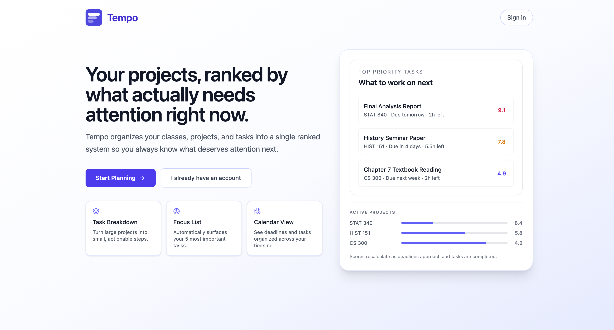
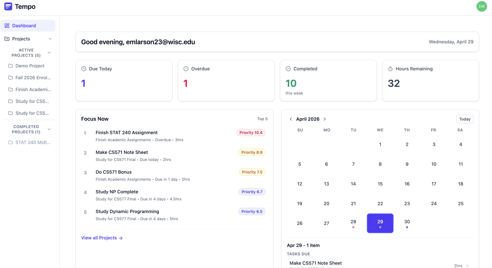
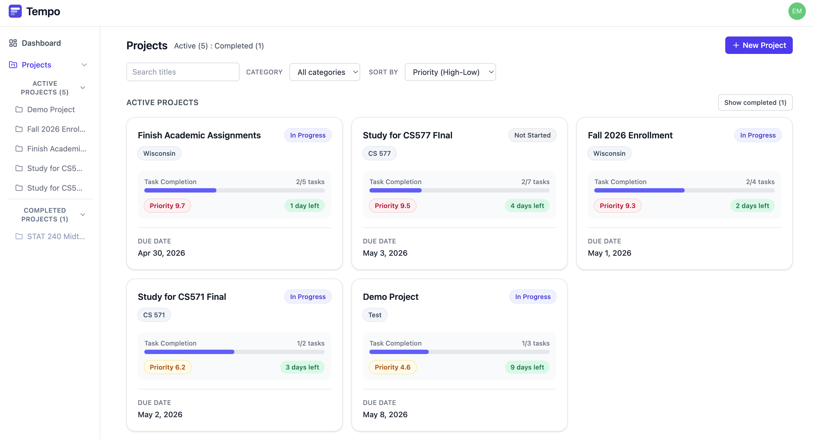
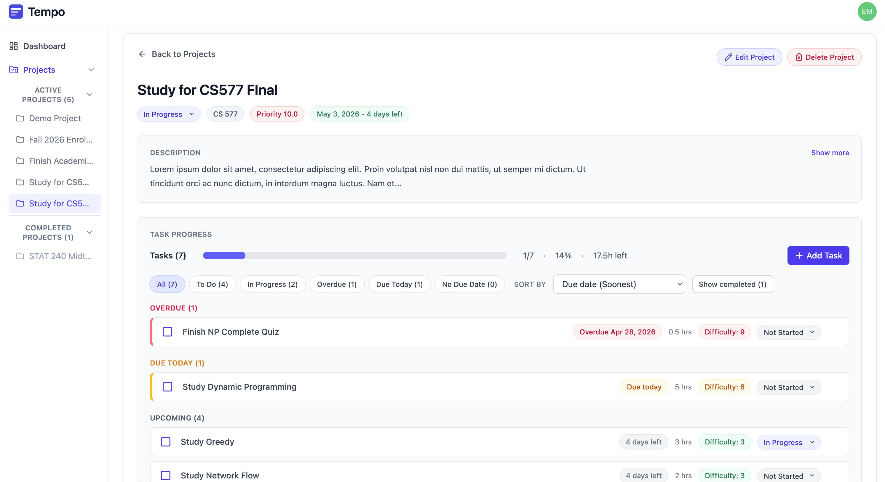

<p align="center">
  
</p>

<h1 align="center" style="font-size: 110px; margin: 0; font-weight: 700;">
  Tempo
</h1>

[](https://react.dev)
[](https://spring.io/projects/spring-boot)
[](https://www.postgresql.org)
[](https://auth0.com)
[](https://withtempo.app)
[](https://railway.app)

 
**Tempo** is a full-stack productivity application that helps users decide what to work on next.

It computes a dynamic priority score for every project and task based on deadlines, workload, progress, and difficulty.
This enables a ranked view of work that highlights the most urgent and impactful tasks across all projects.
 
🔗 **[withtempo.app](https://withtempo.app)**

## Preview

### Landing Page


### Dashboard


### Projects Overview


### Detailed Project View


 
## Table of Contents
 
- [Motivation](#motivation)
- [Features](#features)
- [Tech Stack](#tech-stack)
- [Architecture](#architecture)
- [Priority Algorithm](#priority-algorithm)
- [API Endpoints](#api-endpoints)
- [File Structure](#file-structure)
- [Future Improvements](#future-improvements)

 
## Motivation 

This project was a product of two things — an [existing backend](./backend/README.md) I built last summer, and a Web Project Assignment for UW-Madison's CS571: Building User Interfaces. The course introduced me to the fundamentals of React, React Native, and UI design, and gave me the initial structure for thinking about frontend architecture.

From the class, I knew I wanted my Web Project to extend my existing backend into a full-stack application. What followed was an ~ 8 week development process where I iterated daily, gradually connecting a React frontend to my Spring Boot API and learning how to properly integrate both sides of a system.

Throughout this process, I gained practical experience working across the full stack - including authentication with Auth0, designing and consuming REST APIs, and deploying both frontend and backend services to production environments. I also learned how to think more deliberately about system architecture, data flow, and how frontend state interacts with backend logic in a real application.

Most importantly, this project helped me move beyond building isolated components and toward building a complete system where frontend design, backend logic, and deployment all work together. It was an absolute blast to work on, and I can't wait to keep improving the app as time goes on. There is so much I can build from this starting point!
  
## Features
 
**Projects**
- Create, read, update, and delete projects with title, due date, category, description, difficulty, and estimated hours
- Live priority score (0–10) recalculated on every fetch and after every task change
- Status tracking: Not Started, In Progress, Completed
- Completion timestamp recorded when a project is marked complete
- Filter and sort by priority, due date, status, and category

**Tasks**
- Full CRUD for tasks nested within projects
- Per-task due date, estimated hours, difficulty, and status
- Completion triggers recalculation of the parent project's priority score
- Filter by status, overdue, and due today

**Dashboard**
- Focus Now — top 5 tasks ranked by composite urgency score across all projects
- Stat cards — tasks due today, overdue count, completed this week, total hours remaining
- Calendar — click any date to see projects and tasks due on that day
- Projects strip — all active projects sorted by priority with live progress bars
 
## Tech Stack
 
### Frontend
| Technology | Purpose |
|---|---|
| React 19 | UI framework |
| Vite 7 | Build tool and dev server |
| Tailwind CSS 4 | Styling |
| React Router 7 | Client-side routing |
| Auth0 React SDK | Authentication |
| Lucide React | Icons |
 
### Backend
| Technology | Purpose |
|---|---|
| Java 21 | Language |
| Spring Boot 3.5 | Application framework |
| Spring Security | JWT validation via Auth0 |
| Spring Data JPA | Database ORM |
| PostgreSQL | Relational database |
| Jakarta Validation | Input validation |
 
### Infrastructure
| Service | Purpose |
|---|---|
| Vercel | Frontend hosting |
| Railway | Backend hosting + managed PostgreSQL |
| Auth0 | Identity provider |
 
## Architecture
 
```
Browser (React + Vite)
    │
    │  HTTPS + JWT Bearer token
    ▼
Spring Boot API (Railway)
    │
    │  Spring Security validates JWT against Auth0 JWKS
    │  All queries scoped by userId (Auth0 sub claim)
    ▼
PostgreSQL (Railway)
```
 
The frontend is a single-page React application hosted on Vercel. Every API request includes an Auth0 access token in the `Authorization` header. Spring Security validates the token cryptographically using Auth0's public JWKS (JSON Web Key Set) endpoint. No credentials are stored in the backend.
 
All database queries are filtered by the authenticated user's ID extracted from the JWT `sub` claim, ensuring complete data isolation between users.
  
## Priority Algorithm
 
The project priority score is recalculated on every project fetch and after every task change. The algorithm is as follows:

### Project Priority Score (0–10)

```
priority = baseScore × difficultyMultiplier

baseScore = (timePressure × 0.50) + (workPressure × 0.30) + (progressScore × 0.20)
```

**Time Pressure**

- If overdue: `6.0 + 4.0 / (1 + 0.08 × daysOverdue)`
- Due today: `9.5`
- Not overdue: `9.5 × exp(−0.11 × daysLeft)`

**Work Pressure**

- If overdue: `min(10.0, 2.0 + hoursRemaining × 0.7)`
- Not overdue: `min(10.0, 10 × (1 − exp(−0.3 × hoursPerDay)))`

**Progress Score**

- If no tasks: `daysLeft <= 7 ? 7.0 : 5.0`
- Otherwise: `10 × (1 − completionRatio) × timeAdjustment`
- Where `timeAdjustment` is:
    - `1.3` if overdue
    - `1.2` if due in ≤3 days
    - `1.1` if due in ≤7 days
    - `1.0` otherwise

**Difficulty Multiplier**

- If difficulty is null: `1.25`
- Otherwise: `1.0 + (clamp(difficulty, 1, 10) / 15.0)`

All scores are capped at 10 and rounded to 1 decimal place.
 
### Task Score for Focus Now
 
Individual tasks are scored for the Focus Now dashboard panel using:
 
```
taskScore = taskBaseScore × difficultyMultiplier × lastTaskBonus × (0.6 + 0.4 × projectWeight)
 
taskBaseScore = (taskTimePressure × 0.55) + (taskWorkPressure × 0.45)
```
 
Where `lastTaskBonus = 1.3` if completing the task would finish the entire project, and `projectWeight` is the parent project's priority normalized to 0–1.

 
## API Endpoints
 

### Projects

| Method   | Endpoint                                 | Description                                 |
|----------|------------------------------------------|---------------------------------------------|
| `POST`   | `/api/v1/projects`                       | Create a project                            |
| `GET`    | `/api/v1/projects`                       | Get all projects for authenticated user     |
| `GET`    | `/api/v1/projects/{id}`                  | Get a project by ID                         |
| `PUT`    | `/api/v1/projects/{id}`                  | Update a project                            |
| `PATCH`  | `/api/v1/projects/{id}/status`           | Update project status                       |
| `PATCH`  | `/api/v1/projects/update-priorities`     | Recalculate priority for all projects       |
| `DELETE` | `/api/v1/projects/{id}`                  | Delete a project                            |
| `GET`    | `/api/v1/projects/priority`              | Get projects sorted by priority             |
| `GET`    | `/api/v1/projects/status`                | Get projects filtered by status             |
| `GET`    | `/api/v1/projects/due-in`                | Get projects due within X days              |
| `GET`    | `/api/v1/projects/completed`             | Get completed projects                      |
| `GET`    | `/api/v1/projects/category/{category}`   | Get projects by category                    |

### Tasks

| Method   | Endpoint                                             | Description                                 |
|----------|------------------------------------------------------|---------------------------------------------|
| `POST`   | `/api/v1/projects/{projectId}/tasks`                 | Create a task                               |
| `GET`    | `/api/v1/projects/{projectId}/tasks`                 | Get all tasks for a project                 |
| `GET`    | `/api/v1/projects/{projectId}/tasks/{taskId}`        | Get a specific task                         |
| `PUT`    | `/api/v1/projects/{projectId}/tasks/{taskId}`        | Update a task                               |
| `PATCH`  | `/api/v1/projects/{projectId}/tasks/{taskId}/status` | Update task status                          |
| `DELETE` | `/api/v1/projects/{projectId}/tasks/{taskId}`        | Delete a task                               |
| `GET`    | `/api/v1/projects/{projectId}/tasks/incomplete`      | Get incomplete tasks for a project          |
| `GET`    | `/api/v1/tasks`                                      | Get all tasks for authenticated user        |
| `GET`    | `/api/v1/tasks/status?status={status}`               | Get all tasks filtered by status            |

All endpoints require a valid Auth0 JWT in the `Authorization: Bearer <token>` header.
 
---
 
## File Structure
 
```
momentum-app/
├── frontend/                      # React 18 + Vite app
│   ├── public/                    # Static assets (favicon.svg)
│   ├── src/
│   │   ├── assets/                # (empty)
│   │   ├── components/
│   │   │   ├── common/            # Shared UI (LoadingScreen)
│   │   │   ├── dashboard/         # Dashboard widgets & calendar
│   │   │   │   └── calendar/      # Calendar subcomponents
│   │   │   ├── layout/            # AppLayout, Sidebar, TopBar
│   │   │   ├── projects/          # Project modals, cards, progress bar
│   │   │   └── tasks/             # Task modals, list, rows
│   │   ├── contexts/              # React context (ProjectsContext.jsx)
│   │   ├── pages/                 # Route pages (Dashboard, ProjectsOverview, etc.)
│   │   ├── utils/                 # Utility functions (taskUtils.js)
│   │   ├── App.jsx
│   │   ├── App.css
│   │   ├── index.css
│   │   └── main.jsx
│   ├── index.html
│   ├── package.json
│   ├── vite.config.js
│   ├── vercel.json
│   └── eslint.config.js
│
├── backend/                       # Spring Boot API
│   ├── src/
│   │   ├── main/
│   │   │   ├── java/com/erikmlarson5/deadlinemanager/
│   │   │   │   ├── DeadlineManagerApiApplication.java
│   │   │   │   ├── config/        # SecurityConfig
│   │   │   │   ├── controller/    # ProjectController, TaskController
│   │   │   │   ├── dto/           # Project/Task DTOs, ErrorResponseDTO
│   │   │   │   ├── entity/        # Project, Task entities
│   │   │   │   ├── exception/     # GlobalExceptionHandler
│   │   │   │   ├── repository/    # ProjectRepository, TaskRepository
│   │   │   │   ├── service/       # ProjectService, TaskService
│   │   │   │   └── utils/         # Status enum, mappers
│   │   ├── resources/
│   │   │   ├── application.properties
│   │   │   └── application.properties.example
│   ├── test/java/com/erikmlarson5/deadlinemanager/
│   ├── pom.xml
│   ├── mvnw
│   ├── mvnw.cmd
│   └── README.md
├── README.md
└── ... (git, config, IDE, build folders)
```
 
## Future Improvements
 
- **Canvas LMS integration** — import assignments directly from Canvas an ICS calendar feed, with due dates and course names mapped automatically to projects
- **Profile Page** - set preferences, profile level statistics
- **Email/push notifications** — reminders for tasks due today and overdue items
- **Priority tuning** — user-configurable weights for the priority algorithm factors
- **Dark mode** — manually Toggle Light/Dark mode
- **Bulk import** — create multiple projects from a structured import format
- **Analytics** — historical view of completion rates, streak tracking, and productivity trends
